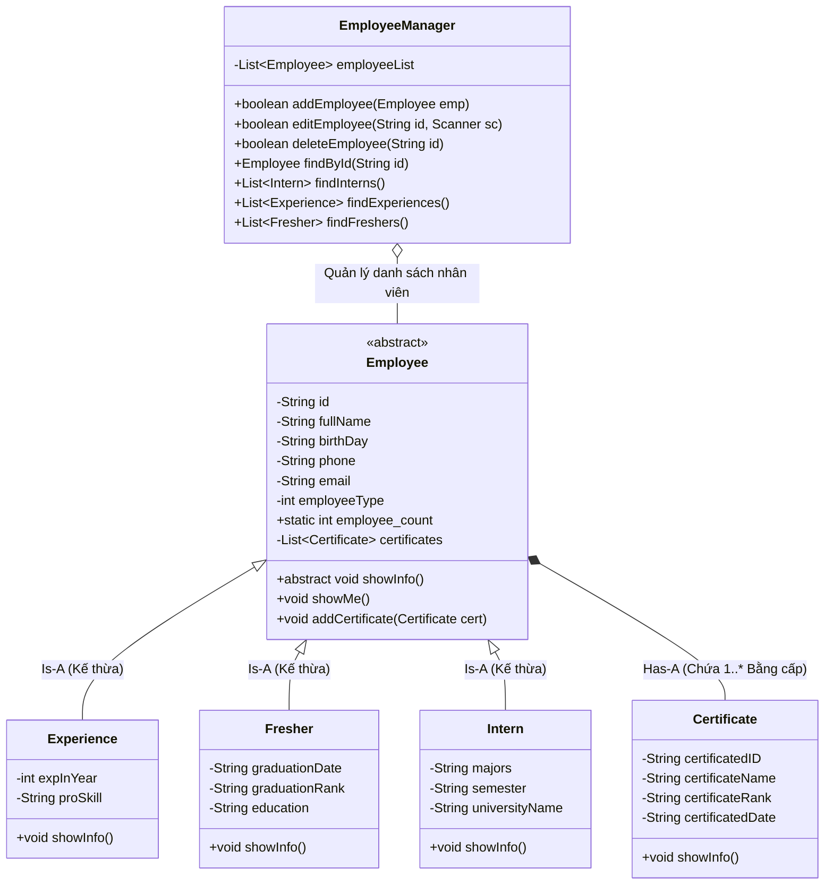

# HƯỚNG DẪN CHI TIẾT TỪNG BƯỚC THỰC HIỆN 12 YÊU CẦU DỰ ÁN JAVA OOP
## PHẦN MỀM QUẢN LÝ NHÂN VIÊN (GIAO DIỆN DÒNG LỆNH CLI)

---

## 📚 Mục Lục
1. [Tổng Quan Cấu Trúc Dự Án](#1-tổng-quan-cấu-trúc-dự-án)
2. [Yêu Cầu 1: Thiết Kế & Áp Dụng 4 Tính Chất Hướng Đối Tượng (OOP)](#2-yêu-cầu-1-thiết-kế--áp-dụng-4-tính-chất-hướng-đối-tượng-oop)
3. [Yêu Cầu 2: Xây Dựng Constructor Cho Tất Cả Các Lớp](#3-yêu-cầu-2-xây-dựng-constructor-cho-tất-cả-các-lớp)
4. [Yêu Cầu 3: Abstract Method, Abstract Class, Override/Overload Method & Static Field](#4-yêu-cầu-3-abstract-method-abstract-class-overrideoverload-method--static-field)
5. [Yêu Cầu 4: Phân Tích Mối Quan Hệ Is-A và Has-A](#5-yêu-cầu-4-phân-tích-mối-quan-hệ-is-a-và-has-a)
6. [Yêu Cầu 5: Sử Dụng và Giải Thích Từ Khóa super và this](#6-yêu-cầu-5-sử-dụng-và-giải-thích-từ-khóa-super-và-this)
7. [Yêu Cầu 6: Toán Tử instanceof và Kỹ Thuật Downcasting](#7-yêu-cầu-6-toán-tử-instanceof-và-kỹ-thuật-downcasting)
8. [Yêu Cầu 7: Xây Dựng Lớp EmployeeManager (Thêm, Sửa, Xóa)](#8-yêu-cầu-7-xây-dựng-lớp-employeemanager-thêm-sửa-xóa)
9. [Yêu Cầu 8: Xây Dựng Các Hàm Kiểm Tra Tính Hợp Lệ Dữ Liệu (Validation)](#9-yêu-cầu-8-xây-dựng-các-hàm-kiểm-tra-tính-hợp-lệ-dữ-liệu-validation)
10. [Yêu Cầu 9: Tìm Kiếm Tất Cả Nhân Viên Intern](#10-yêu-cầu-9-tìm-kiếm-tất-cả-nhân-viên-intern)
11. [Yêu Cầu 10: Tìm Kiếm Tất Cả Nhân Viên Experience](#11-yêu-cầu-10-tìm-kiếm-tất-cả-nhân-viên-experience)
12. [Yêu Cầu 11: Tìm Kiếm Tất Cả Nhân Viên Fresher](#12-yêu-cầu-11-tìm-kiếm-tất-cả-nhân-viên-fresher)
13. [Yêu Cầu 12: Xây Dựng Các Custom Exceptions](#13-yêu-cầu-12-xây-dựng-các-custom-exceptions)
14. [Hướng Dẫn Biên Dịch và Chạy Chương Trình](#14-hướng-dẫn-biên-dịch-và-chạy-chương-trình)

---

## 1. Tổng Quan Cấu Trúc Dự Án

Dự án được phân chia thành các package trực tiếp dưới thư mục `src` giúp cấu trúc ngắn gọn, trực quan và dễ tiếp cận cho người mới bắt đầu:

```
src/
├── entity/       # Chứa các lớp thực thể (Employee, Experience, Fresher, Intern, Certificate)
├── exception/    # Chứa các ngoại lệ tự định nghĩa (BirthDayException, EmailException, PhoneException, FullNameException)
├── util/         # Chứa các hàm tiện ích kiểm tra tính hợp lệ dữ liệu (Validator)
├── service/      # Chứa lớp xử lý nghiệp vụ quản lý (EmployeeManager)
└── main/         # Chứa giao diện dòng lệnh tương tác Menu CLI (Main)
```

### Sơ đồ quan hệ giữa các lớp (Class Diagram):


---

## 2. Yêu Cầu 1: Thiết Kế & Áp Dụng 4 Tính Chất Hướng Đối Tượng (OOP)

Trong dự án này, 4 trụ cột của OOP được áp dụng như sau:

### 2.1. Tính Đóng Gói (Encapsulation)
- **Mục đích**: Che giấu dữ liệu nội bộ của đối tượng, ngăn chặn truy cập hoặc sửa đổi trái phép từ bên ngoài lớp.
- **Áp dụng trong code**:
  - Khai báo các thuộc tính trong `Employee`, `Experience`, `Fresher`, `Intern`, `Certificate` với phạm vi truy cập `private`.
  - Cung cấp các phương thức `Getter` và `Setter` công khai (`public`) để truy cập dữ liệu an toàn.
- **Ví dụ**:
  ```java
  package entity;

  public abstract class Employee {
      private String fullName; // Private - không thể can thiệp trực tiếp từ bên ngoài

      public String getFullName() { // Getter đọc dữ liệu
          return fullName;
      }

      public void setFullName(String fullName) { // Setter gán dữ liệu có kiểm soát
          this.fullName = fullName;
      }
  }
  ```

### 2.2. Tính Kế Thừa (Inheritance)
- **Mục đích**: Tái sử dụng mã nguồn, chia sẻ các thuộc tính và phương thức chung từ lớp cha sang các lớp con.
- **Áp dụng trong code**:
  - `Experience`, `Fresher`, `Intern` sử dụng từ khóa `extends` để kế thừa từ lớp cha `Employee`.
  - Các lớp con tự động sở hữu các thuộc tính chung (`id`, `fullName`, `birthDay`, `phone`, `email`, `certificates`) mà không cần khai báo lại.
- **Ví dụ**:
  ```java
  package entity;

  public class Experience extends Employee {
      private int expInYear;    // Thuộc tính riêng của Experience
      private String proSkill;  // Thuộc tính riêng của Experience
  }
  ```

### 2.3. Tính Đa Hình (Polymorphism)
- **Mục đích**: Cùng một lời gọi phương thức nhưng cho ra hành vi thực thi khác nhau tùy thuộc vào đối tượng thực tế tại thời điểm chạy (Runtime).
- **Áp dụng trong code**:
  - Phương thức `showInfo()` được khai báo trong `Employee` và được mỗi lớp con (`Experience`, `Fresher`, `Intern`) viết lại (`@Override`) để in các thuộc tính riêng biệt của mình.
  - Khi duyệt danh sách `List<Employee>`, ta chỉ cần gọi `emp.showInfo()`, chương trình sẽ tự động gọi phương thức của đúng lớp con cụ thể.
- **Ví dụ**:
  ```java
  for (Employee emp : employeeList) {
      emp.showInfo(); // Đa hình: nếu là Experience -> in số năm kinh nghiệm; nếu là Intern -> in trường ĐH đang học
  }
  ```

### 2.4. Tính Trừu Tượng (Abstraction)
- **Mục đích**: Ẩn đi chi tiết cài đặt phức tạp, chỉ định nghĩa các hành vi cốt lõi ở mức ý niệm chung.
- **Áp dụng trong code**:
  - `Employee` là **Abstract Class** (`public abstract class Employee`). Trong thực tế công ty không có một nhân viên nào "chung chung", mà luôn là một loại nhân viên cụ thể (Experience, Fresher hoặc Intern).
  - Phương thức `public abstract void showInfo();` không có phần thân `{}` trong `Employee`, bắt buộc các lớp con phải tự định nghĩa chi tiết.

---

## 3. Yêu Cầu 2: Xây Dựng Constructor Cho Tất Cả Các Lớp

Constructor là hàm khởi tạo đối tượng, cùng tên với lớp, không có kiểu trả về.

Trong dự án:
1. **Lớp Certificate**:
   - `public Certificate()`: Constructor mặc định.
   - `public Certificate(String id, String name, String rank, String date)`: Constructor đầy đủ tham số.
2. **Lớp trừu tượng Employee**:
   - `public Employee()`: Khởi tạo danh sách bằng cấp và tăng biến đếm `employee_count++`.
   - `public Employee(id, fullName, birthDay, phone, email, employeeType)`: Khởi tạo thông tin cơ bản.
   - `public Employee(id, fullName, birthDay, phone, email, employeeType, List<Certificate> certificates)`: Khởi tạo kèm danh sách bằng cấp.
3. **Các lớp con Experience, Fresher, Intern**:
   - Đều có constructor không tham số và constructor đầy đủ tham số sử dụng `super(...)` để tái sử dụng constructor của lớp cha.

---

## 4. Yêu Cầu 3: Abstract Method, Abstract Class, Override/Overload Method & Static Field

### 4.1. Abstract Class & Abstract Method
- `Employee` là **Abstract Class** (`public abstract class Employee`).
- `public abstract void showInfo();` là **Abstract Method**, là khuôn mẫu bắt buộc lớp con phải Override.

### 4.2. Method Overriding (Ghi đè phương thức)
- Diễn ra giữa **lớp cha và lớp con**. Giữ nguyên tên, danh sách tham số và kiểu trả về.
- Ví dụ: `Experience`, `Fresher`, `Intern` ghi đè phương thức `showInfo()` từ `Employee`.
- Ghi đè phương thức `toString()` kế thừa từ lớp `java.lang.Object`.

### 4.3. Method Overloading (Nạp chồng phương thức)
- Diễn ra **trong cùng một lớp**. Cùng tên phương thức nhưng **khác nhau về danh sách tham số**.
- Ví dụ trong `Employee`:
  ```java
  // Overload 1: Nhận trực tiếp đối tượng Certificate
  public void addCertificate(Certificate cert) {
      this.certificates.add(cert);
  }

  // Overload 2: Nhận 4 chuỗi String rời và tự tạo đối tượng
  public void addCertificate(String certId, String certName, String certRank, String certDate) {
      Certificate cert = new Certificate(certId, certName, certRank, certDate);
      this.certificates.add(cert);
  }
  ```

### 4.4. Static Field (Thuộc tính tĩnh)
- `public static int employee_count = 0;` trong lớp `Employee`.
- Thuộc tính `static` thuộc về **Lớp (Class level)** chứ không thuộc riêng một đối tượng nào. Tất cả các instance của `Employee` đều chia sẻ chung một giá trị `employee_count`.
- Mỗi khi tạo một nhân viên mới, `employee_count` được tăng lên 1 (`employee_count++`).

---

## 5. Yêu Cầu 4: Phân Tích Mối Quan Hệ Is-A và Has-A

### 5.1. Quan hệ Is-A (Là một - Kế thừa)
- Thể hiện thông qua từ khóa `extends`.
- **Trong dự án**:
  - `Experience is a Employee` (Nhân viên có kinh nghiệm là một Nhân viên).
  - `Fresher is a Employee` (Nhân viên mới ra trường là một Nhân viên).
  - `Intern is a Employee` (Nhân viên thực tập là một Nhân viên).

### 5.2. Quan hệ Has-A (Có một / Sở hữu)
- Thể hiện khi một lớp chứa thuộc tính là một đối tượng hoặc danh sách đối tượng của lớp khác.
- **Trong dự án**:
  - `Employee has a List<Certificate>` (Một Nhân viên có thể sở hữu một hoặc nhiều Bằng cấp).
  - `EmployeeManager has a List<Employee>` (Hệ thống quản lý sở hữu một danh sách các Nhân viên).

---

## 6. Yêu Cầu 5: Sử Dụng và Giải Thích Từ Khóa super và this

### 6.1. Từ khóa `this`
- `this` trỏ đến **chính đối tượng hiện tại** (Current Instance).
- **Phân biệt thuộc tính và tham số**:
  ```java
  public void setFullName(String fullName) {
      this.fullName = fullName; // this.fullName là thuộc tính của class, fullName là tham số hàm
  }
  ```
- **Constructor Chaining (Gọi constructor khác trong cùng lớp)**:
  ```java
  public Employee(String id, String fullName, String birthDay, String phone, String email, int type, List<Certificate> certs) {
      this(id, fullName, birthDay, phone, email, type); // Tái sử dụng constructor 6 tham số
      this.certificates = certs;
  }
  ```

### 6.2. Từ khóa `super`
- `super` trỏ đến **lớp cha trực tiếp** (Parent/Super Class).
- **Gọi constructor của lớp cha**:
  ```java
  public Experience(String id, String fullName, String birthDay, String phone, String email, int expInYear, String proSkill) {
      super(id, fullName, birthDay, phone, email, 0); // Gọi constructor của Employee
      this.expInYear = expInYear;
      this.proSkill = proSkill;
  }
  ```

---

## 7. Yêu Cầu 6: Toán Tử instanceof và Kỹ Thuật Downcasting

### 7.1. Toán tử `instanceof` là gì?
- `instanceof` dùng để kiểm tra kiểu đối tượng tại runtime.
- Cú pháp: `object instanceof ClassName` -> Trả về `true` nếu đối tượng là một thể hiện của lớp đó.

### 7.2. Kỹ thuật Downcasting (Ép kiểu xuống)
- Chuyển kiểu tham chiếu từ Lớp cha về Lớp con để truy xuất các thuộc tính/phương thức đặc thù của lớp con.
- **Ứng dụng an toàn trong dự án**:
  ```java
  if (emp instanceof Experience) {
      Experience expEmp = (Experience) emp; // Downcasting an toàn
      System.out.println("Kinh nghiệm: " + expEmp.getExpInYear());
  } else if (emp instanceof Fresher) {
      Fresher fresherEmp = (Fresher) emp;   // Downcasting an toàn
      System.out.println("Xếp loại tốt nghiệp: " + fresherEmp.getGraduationRank());
  }
  ```

---

## 8. Yêu Cầu 7: Xây Dựng Lớp EmployeeManager (Thêm, Sửa, Xóa)

Lớp `service.EmployeeManager` quản lý danh sách `List<Employee> employeeList`:

### 8.1. Thêm nhân viên (`addEmployee`)
- Kiểm tra trùng lặp ID trước khi thêm. Nếu ID đã tồn tại thì báo lỗi và từ chối thêm.

### 8.2. Sửa thông tin nhân viên theo ID (`editEmployee`)
- Nhập ID từ bàn phím để xác định nhân viên.
- Cho phép chỉnh sửa thông tin chung (Họ tên, Ngày sinh, SĐT, Email) có validate exception.
- Sử dụng `instanceof` và Downcasting để nhận diện chính xác loại nhân viên và cập nhật các trường riêng biệt.
- Hỗ trợ thêm bằng cấp (`Certificate`) mới cho nhân viên.

### 8.3. Xóa nhân viên theo ID (`deleteEmployee`)
- Tìm kiếm theo ID. Nếu tồn tại, hiển thị xác nhận và xóa khỏi danh sách.

---

## 9. Yêu Cầu 8: Xây Dựng Các Hàm Kiểm Tra Tính Hợp Lệ Dữ Liệu (Validation)

Được định nghĩa tại lớp `util.Validator`:

1. **`validateBirthday(String birthday)`**:
   - Định dạng `dd/MM/yyyy` với `setLenient(false)` (chặn các ngày không có trong lịch như `30/02`, `31/04`).
   - Kiểm tra năm sinh hợp lý (từ 1900 đến năm hiện tại).
   - Ném ngoại lệ `BirthDayException` nếu sai.

2. **`validateEmail(String email)`**:
   - Sử dụng Regex: `^[a-zA-Z0-9._%+-]+@[a-zA-Z0-9.-]+\.[a-zA-Z]{2,6}$`
   - Ném ngoại lệ `EmailException` nếu sai định dạng.

3. **`validatePhone(String phone)`**:
   - Sử dụng Regex: `^0[0-9]{9}$` (đủ 10 chữ số, bắt đầu bằng số 0).
   - Ném ngoại lệ `PhoneException` nếu sai định dạng.

4. **`validateFullName(String fullName)`**:
   - Kiểm tra không rỗng và chỉ chứa chữ cái tiếng Việt cùng khoảng trắng.
   - Ném ngoại lệ `FullNameException` nếu chứa chữ số/ký tự đặc biệt.

---

## 10. Yêu Cầu 9: Tìm Kiếm Tất Cả Nhân Viên Intern

Trong `EmployeeManager`:
```java
public List<Intern> findInterns() {
    List<Intern> interns = new ArrayList<>();
    for (Employee emp : employeeList) {
        if (emp instanceof Intern) {
            interns.add((Intern) emp); // Downcast sang Intern
        }
    }
    return interns;
}
```

---

## 11. Yêu Cầu 10: Tìm Kiếm Tất Cả Nhân Viên Experience

Trong `EmployeeManager`:
```java
public List<Experience> findExperiences() {
    List<Experience> experiences = new ArrayList<>();
    for (Employee emp : employeeList) {
        if (emp instanceof Experience) {
            experiences.add((Experience) emp); // Downcast sang Experience
        }
    }
    return experiences;
}
```

---

## 12. Yêu Cầu 11: Tìm Kiếm Tất Cả Nhân Viên Fresher

Trong `EmployeeManager`:
```java
public List<Fresher> findFreshers() {
    List<Fresher> freshers = new ArrayList<>();
    for (Employee emp : employeeList) {
        if (emp instanceof Fresher) {
            freshers.add((Fresher) emp); // Downcast sang Fresher
        }
    }
    return freshers;
}
```

---

## 13. Yêu Cầu 12: Xây Dựng Các Custom Exceptions

Các lớp ngoại lệ tùy chỉnh trong package `exception` kế thừa từ `java.lang.Exception`:

- **`BirthDayException`** ([BirthDayException.java](file:///Users/tamnguyen/Projects/learning/java/baitap_java_canban_nhom1/src/exception/BirthDayException.java))
- **`EmailException`** ([EmailException.java](file:///Users/tamnguyen/Projects/learning/java/baitap_java_canban_nhom1/src/exception/EmailException.java))
- **`PhoneException`** ([PhoneException.java](file:///Users/tamnguyen/Projects/learning/java/baitap_java_canban_nhom1/src/exception/PhoneException.java))
- **`FullNameException`** ([FullNameException.java](file:///Users/tamnguyen/Projects/learning/java/baitap_java_canban_nhom1/src/exception/FullNameException.java))

---

## 14. Hướng Dẫn Biên Dịch và Chạy Chương Trình

### 14.1. Biên dịch từ Terminal/Command Prompt
Mở terminal tại thư mục gốc của dự án (`baitap_java_canban_nhom1`):

```bash
# Biên dịch toàn bộ mã nguồn sang thư mục bin
javac -d bin -encoding UTF-8 $(find src -name "*.java")
```

*(Trên Windows CMD: `javac -d bin -encoding UTF-8 -sourcepath src src/main/Main.java`)*

### 14.2. Chạy chương trình
```bash
java -cp bin main.Main
```

### 14.3. Các chức năng trên Menu CLI:
1. `1`: Thêm nhân viên mới (Experience / Fresher / Intern) có bắt ngoại lệ.
2. `2`: Chỉnh sửa thông tin nhân viên theo ID.
3. `3`: Xóa nhân viên theo ID.
4. `4`: Hiển thị danh sách tất cả nhân viên trong hệ thống.
5. `5`: Tìm kiếm nhân viên theo ID.
6. `6`: Lọc và hiển thị tất cả Intern (Yêu cầu 9).
7. `7`: Lọc và hiển thị tất cả Experience (Yêu cầu 10).
8. `8`: Lọc và hiển thị tất cả Fresher (Yêu cầu 11).
9. `9`: Xem biến tĩnh `Employee.employee_count`.
10. `10`: Nạp thêm dữ liệu mẫu (Sample Data).
11. `0`: Thoát chương trình.
